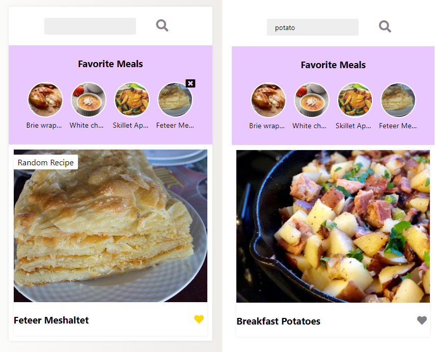

# Recipe App 
## See the bests recipes in the world

check on : https://app-recipe.netlify.app/

### Features Used - With the following features

   * List of Recipes
   * Recipe info on Click
   * Favorite Recipe (with localStorage)
   * Show Details

### 🛠 Technologies

The following tools were used in the construction of the project:

* Javascript
* TheMealDB Api (https://www.themealdb.com/)
* SVG Icons (https://fontawesome.com/)
* Gradient Colors (https://uigradients.com/)

### Pictures 

  
   

